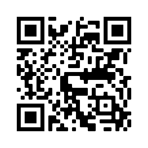

# 🖐 Olá, como vai? 
### Mais um desafio da comunidade do Iuri Silva, espero que gostem e fiquem a vontade. 😀

### 📸 Algumas imagens do projeto: 

### Caso queira dar uma olhada: <a href="https://hugocamposarimathea.github.io/Desafio3/" alt="Link da página">Clique aqui</a>
### Ou escaneie o QR Code: 

### 📧 Caso queira conversar:
 

    
     
  
 
