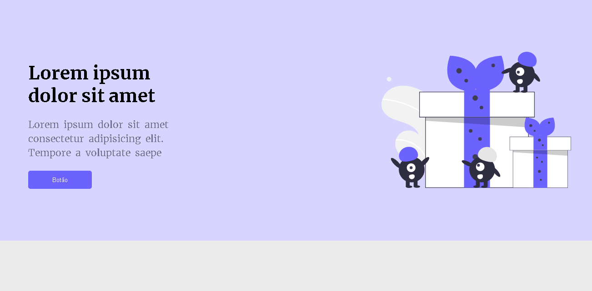
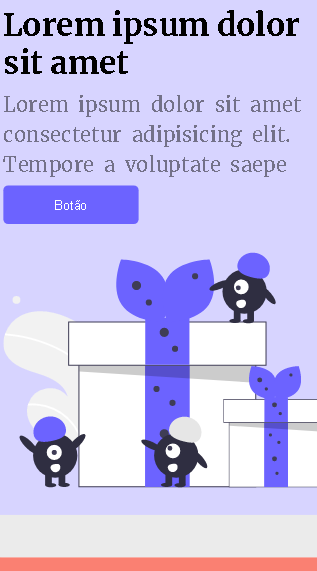
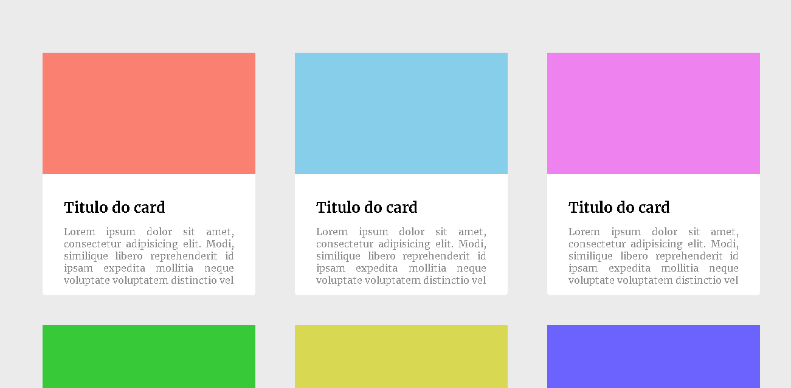
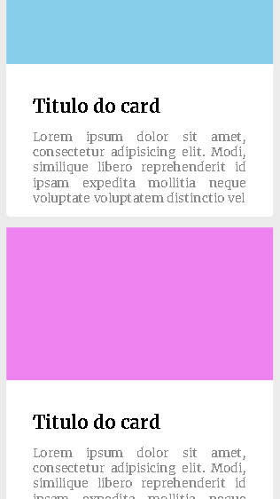
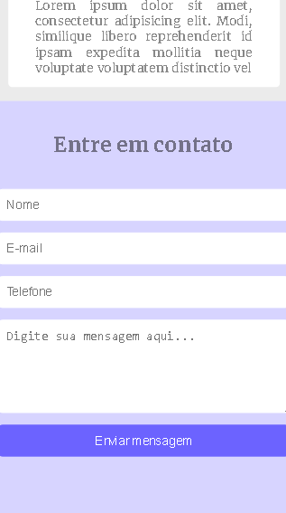

<h1>🖐 Olá, como vai?   <em>🖐 Hello, how are you?</em></h1> 
<h4>Mais um desafio da comunidade do <a href="https://github.com/iuricode" target="_blank">Iuri Silva</a>, espero que gostem e fiquem a vontade. 😄</h4>
 
<h4><em>One more challenge of the <a href="https://github.com/iuricode" target="_blank">Iuri Silva's</a> community, I hope you like and feel free to take a look. 😄</em></h4>

<h3>📸 Algumas imagens do projeto:   <em>📸 Some photos of the project:</em></h3> 
 

 
 
 
 
 
 

<h3>Caso queira dar uma olhada:   <em>If you want to take a look:</em></h3> 
<h3><a href="https://hugocamposarimathea.github.io/Desafio3/" alt="Link da página">👉 Clique aqui 👈   <em>👉 Click here to go 👈</em></a></h3>
 
<h3>Ou escaneie o QR Code: 📱   <em>Or point your cellphone camera for QR code: 📱</em></h3>
 

 

<h3>📧 Caso queira conversar:   <em>📧 If you want to talk with me, send me an email:</em></h3>
 

    
     
  
 

